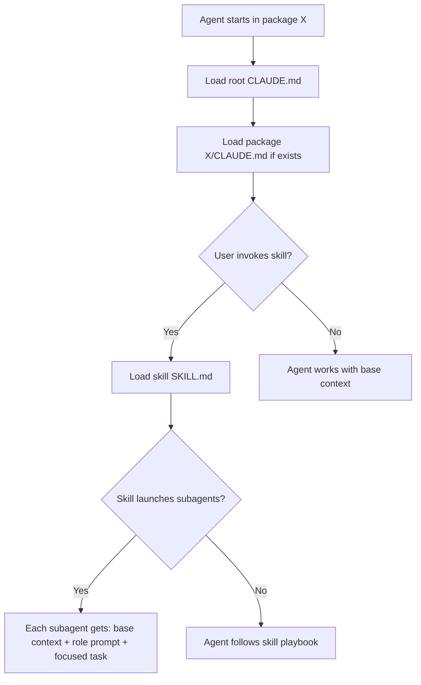
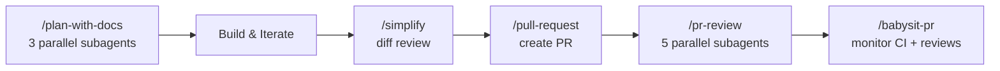

# Anatomy: How This Repo's Agent Infrastructure Works

Annotated tour of every agent-related file in the Temper codebase.

---

## Directory Structure

```
.claude/
├── settings.json          ← hooks config (format-on-write, prod guard)
├── hooks/
│   └── prod-guard.sh      ← blocks dangerous prod operations
├── agents/
│   ├── general-agent-opus.md       ← default subagent (opus, all tools)
│   ├── workflow-code-review.md     ← scoped review agent (opus, limited tools)
│   └── workflow-prod-verify.md     ← deploy checker (sonnet, Bash+Read only)
├── skills/                ← 32 skills organized by domain
│   ├── plan-with-docs/    ← 3 parallel subagents for planning
│   ├── pr-review/         ← 5 parallel subagents for review
│   ├── codebase-audit/    ← 3 parallel subagents for auditing
│   ├── database/          ← migration patterns
│   ├── operations*/       ← 8 operations runbooks
│   └── ...
└── docs/
    └── git-workflow.md    ← branch/commit conventions

CLAUDE.md                  ← root instructions (always loaded)
AGENTS.md → CLAUDE.md      ← symlink for Codex compat
conductor.json             ← Conductor workspace config

apps/api/CLAUDE.md         ← API-specific patterns
apps/frontend/CLAUDE.md    ← frontend-specific patterns
packages/database/CLAUDE.md ← migration golden rules
```

---

## How Context Flows to Agents



---

## The SDLC Pipeline



Each step is a separate skill invocation. Agents can be at different steps simultaneously — one agent planning feature A while another reviews PR for feature B.

---

## Skill Anatomy

Every skill follows this pattern:

```yaml
---
name: skill-name
description: When to trigger this skill
allowed-tools: [Read, Write, Bash, Task, ...]
model: opus  # optional: force a specific model
---

# Skill Title

## Workflow
### Phase 1: ...
### Phase 2: ...

## Anti-Patterns
- DON'T: ...
- DO: ...

## Integration
- Use alongside: other-skill, another-skill
```

**Key fields**:
- `allowed-tools`: Scopes what the agent can do (security boundary)
- `model`: Forces a model tier (cost/quality tradeoff)
- Workflow phases: Step-by-step playbook the agent follows
- Anti-patterns: Explicit guardrails

---

## Agent Definition Anatomy

```yaml
# .claude/agents/workflow-prod-verify.md
---
name: workflow-prod-verify
description: Post-deploy verification
model: sonnet        # cheaper model for procedural work
color: green
---

# Instructions
1. Run kubectl to check pod health
2. Query CloudWatch for errors
3. Compare before/after metrics
4. Output structured report
```

Agents are selected by `subagent_type` in Task tool calls. The model and tool restrictions are enforced by the system.

---

## Hook System

### Pre-execution (prod-guard.sh)
```
Agent tries: bun pull-env prod
  → Hook intercepts
  → Checks against blocklist
  → BLOCKS with explanation
  → Agent must find alternative approach
```

### Post-execution (auto-format)
```
Agent writes: apps/api/src/router.ts
  → Hook runs: biome format --write
  → File is auto-formatted
  → No formatting drift between agents
```

---

## Conductor Integration

```json
// conductor.json
{
  "scripts": {
    "setup": "bun install && bun pull-env $(branch-prefix)",
    "run": "VITE_PORT=$CONDUCTOR_PORT PORT=$((PORT+1)) bun dev",
    "archive": "rm -rf node_modules",
    "open": "http://localhost:$CONDUCTOR_PORT"
  }
}
```

Each Conductor workspace:
- Gets a unique `$CONDUCTOR_PORT` (no port conflicts between worktrees)
- Auto-pulls env vars based on branch prefix
- Runs its own dev server independently
- Can be archived to free disk space
